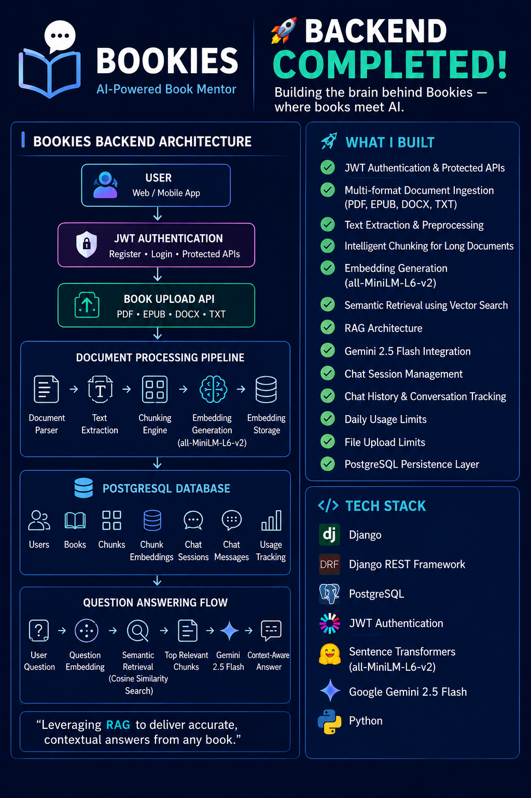
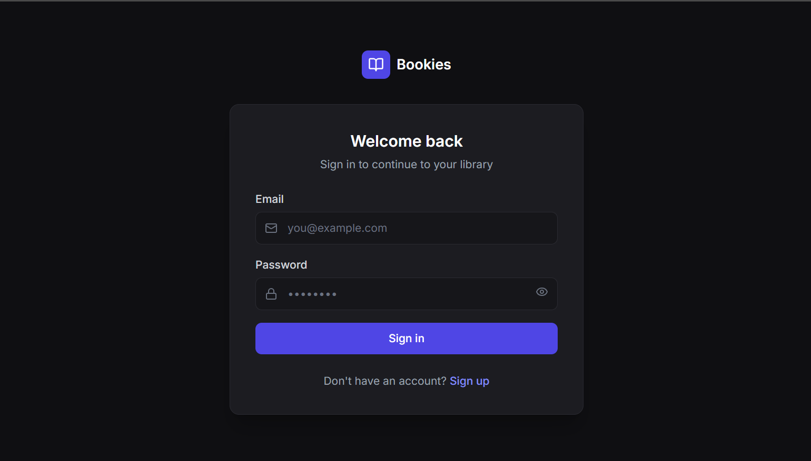
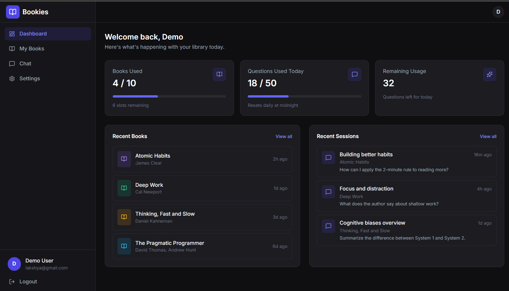
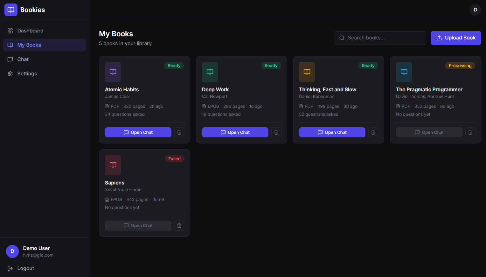
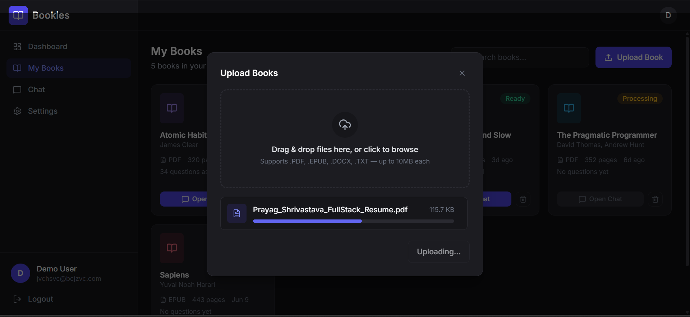
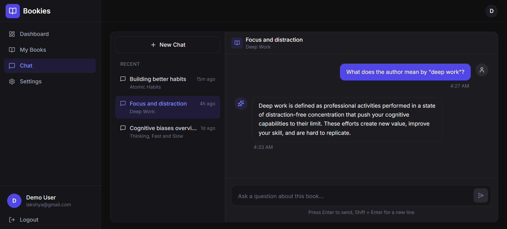
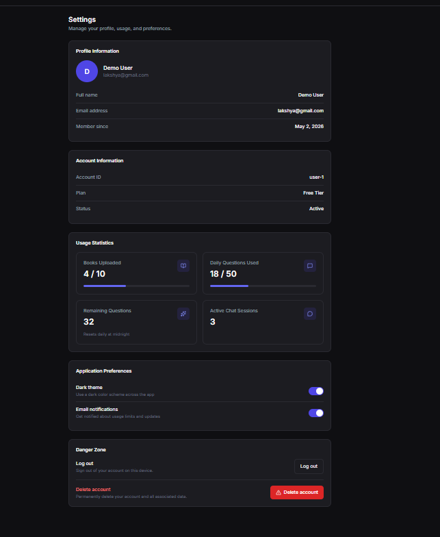

# 📚 Bookies — AI-Powered Book Mentor

> Turn books into conversations with AI-powered, context-aware question answering.

Bookies is a full-stack AI application that enables users to upload books and interact with them through natural language conversations. The platform uses Retrieval-Augmented Generation (RAG), semantic search, and Google Gemini to generate grounded responses based on uploaded book content.

---

## 🚀 Live Status

* ✅ Backend Complete
* ✅ Frontend UI Complete
* 🚧 Backend Integration In Progress
* 🚀 Full Product Launch Coming Soon

---

# 📸 Application Preview

## System Architecture



## Login Page



## Dashboard



## Books Library



## Upload Experience



## AI Chat Interface



## Settings Page



## UI Demonstration
[Click here](https://drive.google.com/file/d/1tLBJbTZ0WuEbAqUGgzo1zmDUls690N-d/view?usp=sharing) for video.

---

# ✨ Features

## Authentication & User Management

* JWT Authentication
* User Registration & Login
* Protected Routes
* User Data Isolation
* Session Management

## Book Management

* Upload Books
* View Uploaded Books
* Delete Books
* Upload Validation
* Usage Limits

## Supported Formats

* PDF
* EPUB
* DOCX
* TXT

## AI-Powered Conversations

* Retrieval-Augmented Generation (RAG)
* Semantic Search
* Context-Aware Responses
* Chat Sessions
* Chat History
* Gemini 2.5 Flash Integration

## Usage Tracking

* Upload Limits
* Daily Question Limits
* Active Session Tracking
* Usage Statistics

---

# 🏗️ System Architecture

```text
Frontend (React + TypeScript)
            │
            ▼
      Axios API Layer
            │
            ▼
 Django REST Framework
            │
 ┌──────────┼──────────┐
 ▼          ▼          ▼
Auth      Books      Chat
            │
            ▼
Document Processing
            │
 ├─ Text Extraction
 ├─ Chunking
 ├─ Embedding Generation
 └─ Semantic Retrieval
            │
            ▼
     PostgreSQL (Neon)
            │
            ▼
    Google Gemini 2.5 Flash
            │
            ▼
     Context-Aware Answers
```

---

# 🧠 RAG Pipeline

```text
Book Upload
     │
     ▼
Text Extraction
     │
     ▼
Document Chunking
     │
     ▼
Embedding Generation
(all-MiniLM-L6-v2)
     │
     ▼
Embedding Storage
     │
     ▼
User Question
     │
     ▼
Question Embedding
     │
     ▼
Semantic Retrieval
     │
     ▼
Relevant Chunks
     │
     ▼
Gemini 2.5 Flash
     │
     ▼
Grounded AI Response
```

---

# 🗄️ Core Data Model

## User

* Authentication
* Profile
* Usage Tracking

## Book

* Title
* File
* Owner
* Upload Timestamp

## Chunk

* Book Reference
* Chunk Content
* Chunk Index

## ChunkEmbedding

* Chunk Reference
* Vector Representation

## ChatSession

* User
* Book
* Session Title

## ChatMessage

* Session
* Role
* Content
* Timestamp

---

# 📡 API Modules

## Authentication

```http
POST /api/auth/register/
POST /api/auth/login/
```

## Books

```http
POST   /api/books/upload/
GET    /api/books/
DELETE /api/books/{id}/
```

## Chat

```http
POST   /api/chat/ask/
GET    /api/chat/history/{session_id}/
POST   /api/chat/sessions/
GET    /api/chat/sessions/
DELETE /api/chat/sessions/{id}/
```

---

# 🛠️ Tech Stack

## Frontend

* React
* TypeScript
* Vite
* Tailwind CSS
* React Router

## Backend

* Python
* Django
* Django REST Framework

## Database

* PostgreSQL
* Neon

## AI / NLP

* Google Gemini 2.5 Flash
* Sentence Transformers
* all-MiniLM-L6-v2
* Semantic Search
* Retrieval-Augmented Generation (RAG)

## Authentication

* JWT Authentication

---

# 🔐 Security

* JWT Authentication
* Protected Endpoints
* User Ownership Validation
* Upload Restrictions
* Usage Limit Enforcement

---

# 🎯 Key Engineering Challenges Solved

### Semantic Retrieval

Implemented embedding-based retrieval to move beyond keyword search and improve answer relevance.

### Multi-Format Document Processing

Built a unified ingestion pipeline supporting PDF, EPUB, DOCX, and TXT files.

### Context-Aware AI Responses

Grounded Gemini responses using retrieved book content to reduce hallucinations.

### Scalable Backend Design

Separated authentication, document processing, retrieval, and chat systems into modular services.

---

# 📚 Learning Outcomes

Through Bookies, I gained hands-on experience with:

* Retrieval-Augmented Generation (RAG)
* Semantic Search
* Embedding Models
* LLM Integration
* Django REST Framework
* PostgreSQL
* JWT Authentication
* React + TypeScript
* REST API Development
* Full-Stack AI Application Architecture

---

# 🔮 Roadmap

### Completed

* Authentication System
* Book Upload Pipeline
* Text Extraction
* Chunking Engine
* Embedding Generation
* Semantic Retrieval
* Chat Sessions
* Chat History
* Frontend UI
* Gemini Integration

### Upcoming

* Frontend ↔ Backend Integration
* Production Deployment
* SaaS Analytics
* Usage Dashboard Enhancements
* Full Public Launch

---

# 👨‍💻 Author

**Prayag Shrivastava**

Bookies is an AI-powered Book Mentor platform that transforms books into interactive conversations through Retrieval-Augmented Generation (RAG), semantic search, and modern AI systems.

⭐ Full application launch coming soon.
